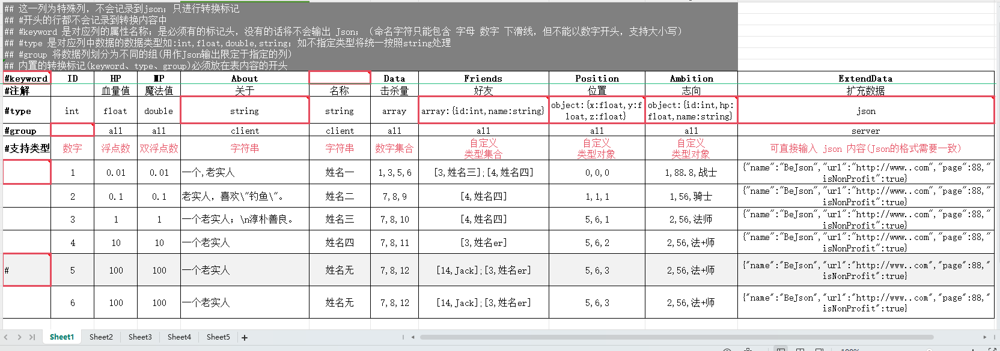
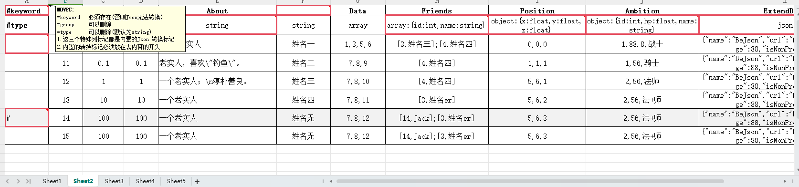
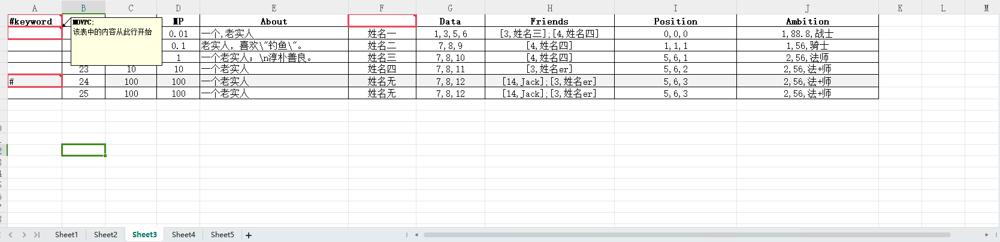
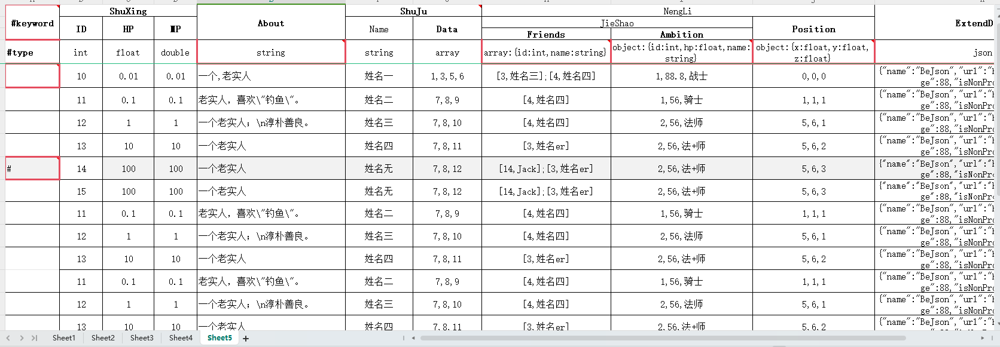

# ExcelToConfigGame

用于将 Excel 文件转换为 Json 数据(JArray/JObject)

可利用 bat 或cmd 命令设定一个 Excel 文件转 json 的逻辑规则，将所有的配置文件统一指定，并处理为 json 再输出到游戏项目中

## bat 文件设定参数

```
searchOption 0|1		//TopDirectoryOnly(仅限顶级目录) | AllDirectories(所有的目录)
sourceDirectory			//源文件(Excel.xlsx) 目录;为空则为当前bat目录
targetDirectory			//输出文件的目录;为空则为当前bat目录 
jsonformat -1|0|1		//json输出格式； -1 不处理 | 0 单行排版 | 1 锯齿排版
program xxx				//选择不同的程序功能；
						MultFileLanguage --多语言输出; 
						Json --json转换
						UniqueCharacter --唯一字符提取(将所有文件中的字符提取到一份文件中)，原文件目录可为多个用::进行分割
extensions xxx			//读取的文件扩展名(Excel 只支持 .xlsx; UniqueCharacter中可自定定义,默认为".txt,.xml,.json,.yml")
autoExit 0|1			//0 程序结束后手动关闭；1 程序结束后自动关闭
jsonGroup xxx			//excel 中存在#group 行则进行过滤，只转换与xxx名字相同的列
unGroupDirectory xxx	//excel 不存在#group 行则指定 Excel 输出文件的目录;为空则在jsonGroup过滤下不输出
sheetName xxx			//excel 只转换对应的Sheet组，sheet 名为 xxx
jsonType JArray|JObject	//默认为JArray会将Excel 输出为 JArray 的格式，JObject 会输出字典格式必须设定一个主键作为字典的Key
mainkey xxx				//JObject 的主键定义
startCell A1			//excel 读取时的起始位置(默认为A1)
endCell					//excel 读取时的结束位置(默认为无限)
```


在 ExcelConfig\design\数据配表.xlsx 文件中可查看对应的 excel 模版文件

在 ExcelConfig\design中可查看对应的范例  <a href="./ExcelConfig/design">范例地址</a>


## Excel 支持的模版格式

更多详情查看 design 中的文件









