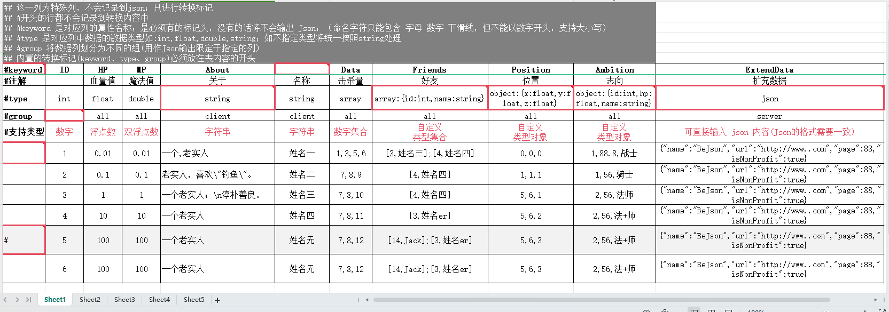
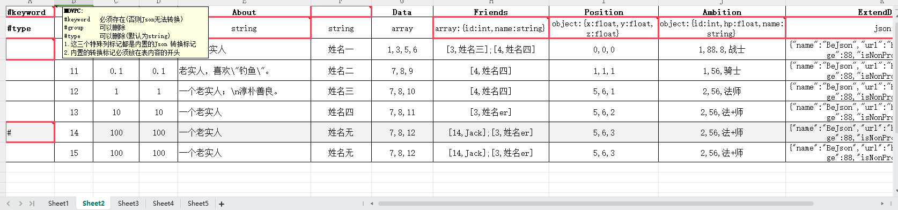
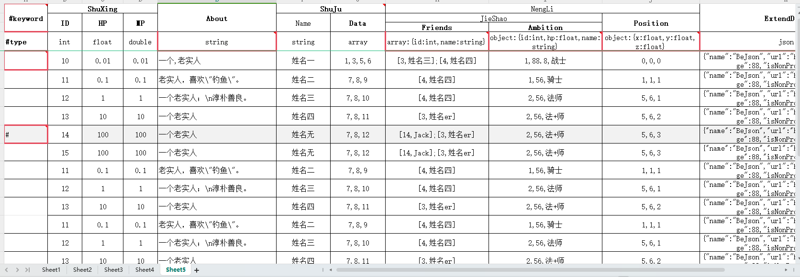

## bat 文件设定参数

```
searchOption 0|1		//TopDirectoryOnly(仅限顶级目录) | AllDirectories(所有的目录)
sourceDirectory			//源文件(Excel.xlsx) 目录;为空则为当前bat目录
targetDirectory			//输出文件的目录;为空则为当前bat目录 
jsonformat -1|0|1		//json输出格式； -1 不处理 | 0 单行排版 | 1 锯齿排版
program xxx				//选择不同的程序功能；MultFileLanguage --多语言输出; Json --json转换
autoExit 0|1			//0 程序结束后手动关闭；1 程序结束后自动关闭
jsonGroup xxx			//excel 中存在#group 行则进行过滤，只转换与xxx名字相同的列
unGroupDirectory xxx	//excel 不存在#group 行则指定 Excel 输出文件的目录;为空则在jsonGroup过滤下不输出
sheetName xxx			//excel 只转换对应的Sheet组，sheet 名为 xxx
```


在 ExcelConfig\design\数据配表.xlsx 文件中可查看对应的 excel 模版文件

在 ExcelConfig\design中可查看对应的范例









